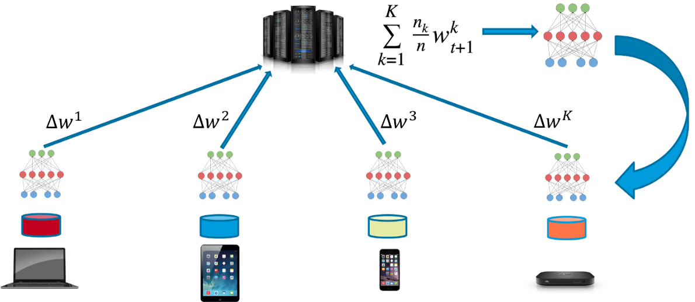
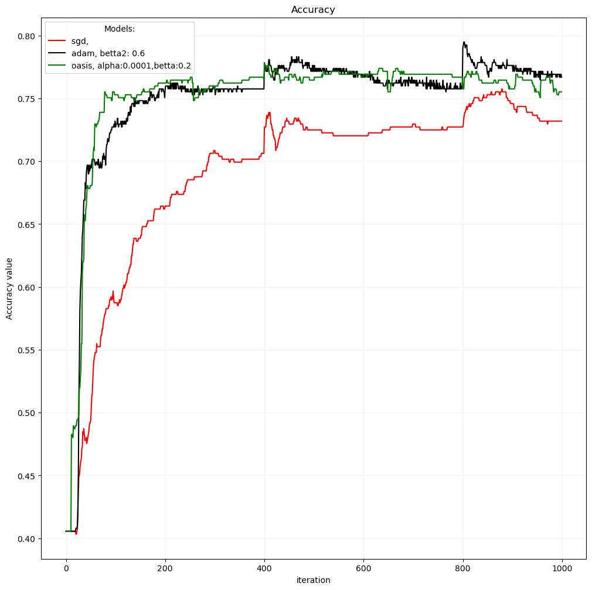
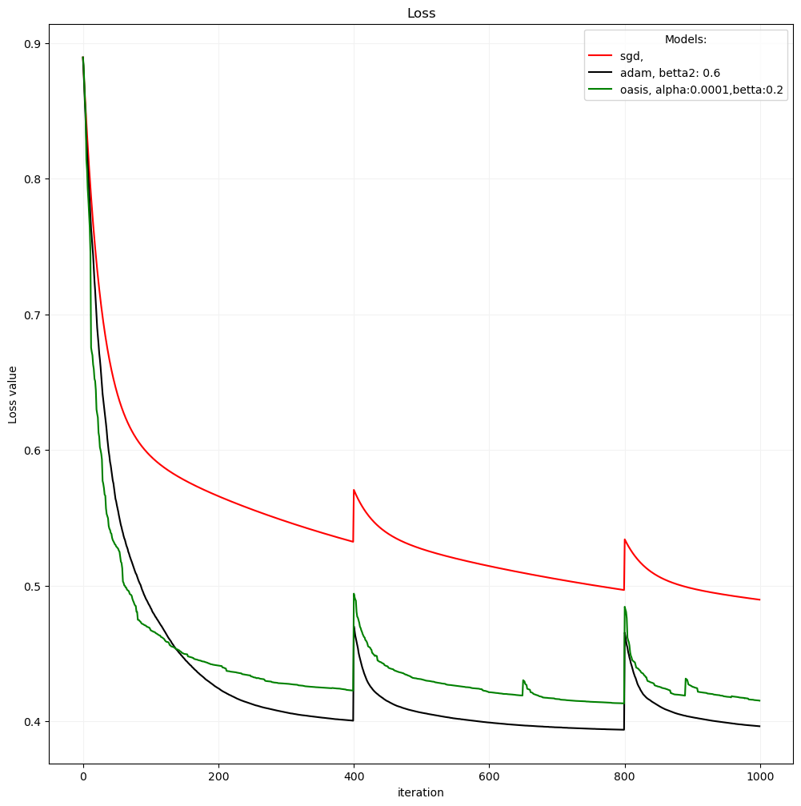
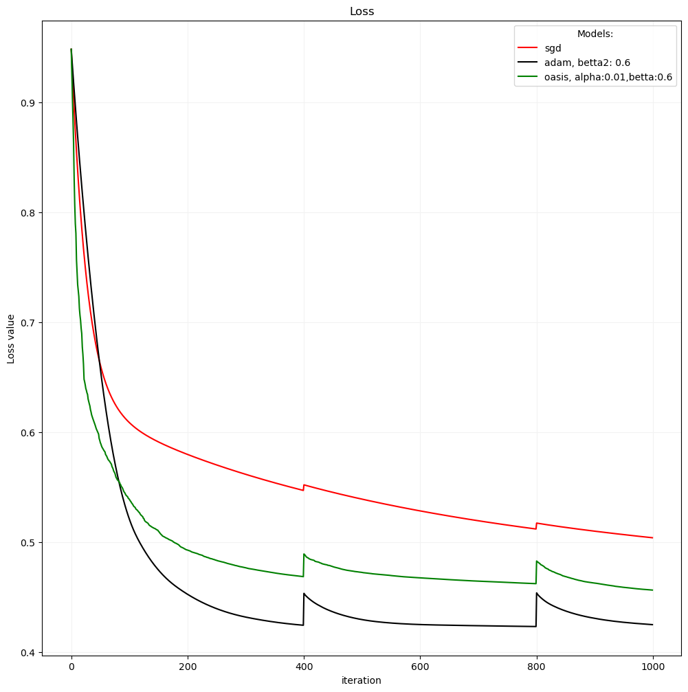
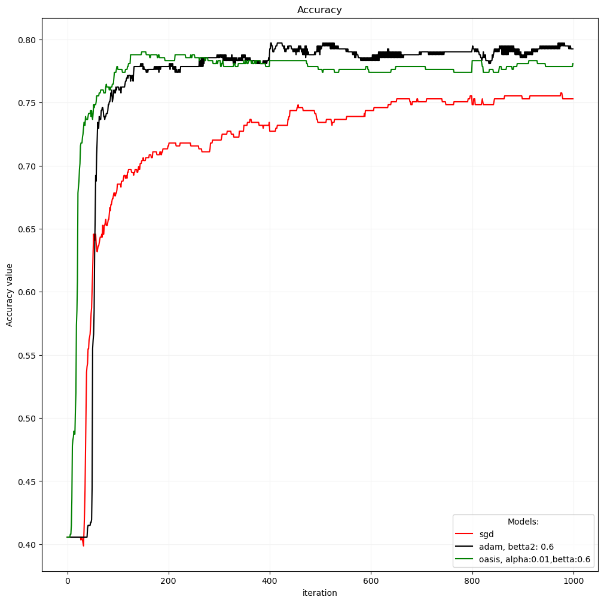

# FederatedLearning

In this project we have applied Federated learning with avaraging to train machine learning model on some number of workers. We neede to optimize equation:

$$
    \min_{x \in R^d} { f(x) = \frac{1}{M} \sum_{m=1}^{M} f_m (x)},
$$

Then we tried some optimization methods(preconditioners: SGD,Adam, OASIS). Final results are on folder `Reports/Tuning_prec`

## Problem
- Task: Binary classification
- Model: Logistic Regression

$$
\begin{cases}
    z = wX + b \\
    y = \frac{1}{1 + \exp^{-z}} \\
\end{cases}
$$

- Optimization function

    $W = W - lr * (D_k)^{-1} * grad$

- Loss: Cross Entropy

$$
    loss = - \sum_{i \in Data} y_{i,true} log(y_{i,pred}) + (1 - y_{i,true} ) log(1-y_{i,pred})
$$

- Other metrics: Accuracy

$$
    accuracy = \frac{number\ of\ elements\ predicted\ correctly}{number\ of\ elements}
$$
- Federated learning (FL)\
FL means that we apply model to some part of dataset (which available on worker) and run some number epochs (local stels) and then avarage model parameters from all workers (gloval step). (Picture above ilustrate this process)

## Preconditioners 
We tried to run Federated learning model with Adam and OASIS optimizers.
For this perpous we apply preconditioning for SGD.

## Structure
`/Models` folder contain implementation of Logistic Regression model,
Federated Learnning related classes (Worker, Server) and other files related to implemetation \
`/Reports` folder contain ipynb files from which you may run experiments (Identical, Heterogenious data splits) \
- `/Reports/3Tuning_prec` shows tuning of preconditioners and contain plots of loss and accuracy for each experiments

## Results
Finaly we tuned both optimizers and draw final results.

### Heterogenious split

### Identical split

